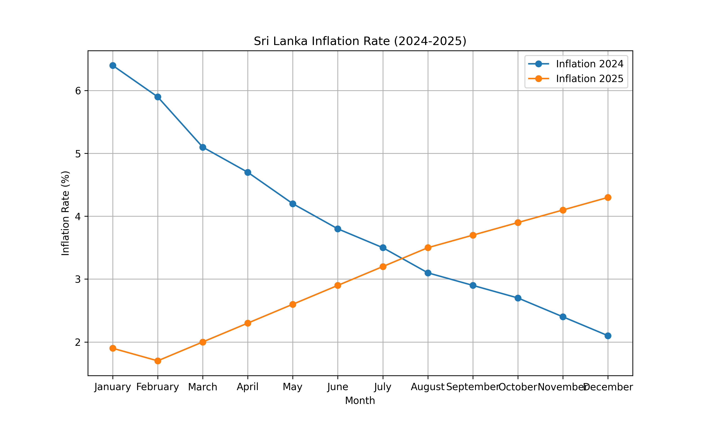
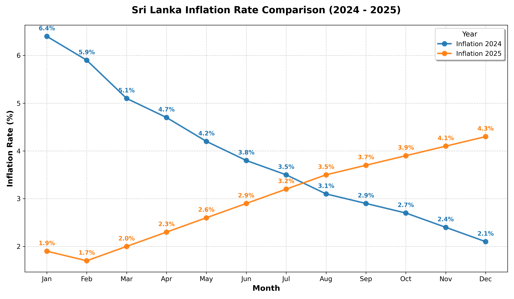

# Agentic AI Design Patterns

A hands-on learning repository for implementing common agentic AI design patterns in Python.

## Project Structure

```text
agent-design-pattern/
|- README.md
|- .env
|- agent-reflection/
|  |- example_1/
|  |  |- agent_reflection.py
|  |  |- requirements.txt
|  |  |- sri_lanka_inflation_2024_2025.csv
|  |  |- chart_v1.png
|  |  |- chart_v2.png
|  |- example_2/
|     |- agent_reflection_v2.py
|     |- requirements.txt
|     |- utils.py
|- agent-tools-selection/
|  |- example_1/
|     |- agent_tools_selection.py
|- research-agent/
   |- research-agent.py
```

## 1. Reflection Pattern

Reflection is an agentic pattern where an AI system improves its own output through a second-pass critique.

### Example 1: Chart Reflection

Location: `agent-reflection/example_1/`

Flow:
1. A fast model generates initial matplotlib code to visualize Sri Lanka inflation data.
2. The generated code is executed to create an initial chart (`chart_v1.png`).
3. A second model reviews both the chart and the first code draft.
4. The system regenerates improved chart code and produces a refined chart (`chart_v2.png`).
5. The workflow now includes exception handling for API calls, chart file loading, generated-code parsing, and `exec` execution failures.

This demonstrates how reflection can improve output quality with a critique-and-revise loop.

### Example 2: SQL Reflection

Location: `agent-reflection/example_2/`

Flow:
1. A model generates draft SQL from a schema and question.
2. The draft SQL is executed via `utils.exec_sql`.
3. Execution output is used as feedback for a reflection pass.
4. The model returns refined SQL and a short feedback summary.
5. The script now handles malformed JSON responses, empty SQL outputs, and SQL execution errors.

## 2. Tool Selection Pattern

Location: `agent-tools-selection/example_1/`

The tools-use example shows how an agent can select and call functions from a predefined tool set:
- `get_current_time`
- `get_weather_from_ip`
- `write_txt_file`
- `generate_qr_code`

Recent updates add exception handling around network requests, file writes, QR generation, and model response parsing during function-calling loops.

## 3. Planning Pattern

Planning is the agentic pattern where the model first decides what to do in structured steps, then executes those steps in code.

In this repository, the idea can be understood as:
- JSON as the planning layer: a structured plan that lists the goal, steps, tools, and expected output.
- Code as the action layer: Python code that carries out the planned steps, calls tools, and produces results.

This separation helps the agent stay organized. The JSON plan makes the reasoning easy to inspect and adjust, while the code handles the actual work.

Typical flow:
1. Define the goal.
2. Break the goal into JSON planning steps.
3. Execute the steps in code.
4. Check the result and refine the plan if needed.

## 4. Multi-agent Coordination

Multi-agent coordination covers how multiple agents communicate and collaborate to achieve a shared goal. Below are common communication patterns and when to use them.

- Linear communication (chain): agents are arranged in a chain; each agent talks to its immediate neighbor. Use when workflows are strictly sequential and latency is low. Pros: simple, predictable. Cons: slow propagation, single-point bottlenecks.

- Hierarchical communication (tree): a root or coordinator delegates to intermediate agents which delegate further. Use for divide-and-conquer tasks with clear responsibility. Pros: scalable, clear ownership. Cons: needs robust coordinators.

- Deep hierarchical: multiple pyramid levels with more depth; useful for large organizations where local aggregations feed upstream. Watch for information loss at aggregation points and design checkpoints.

- All-to-all (fully connected): every agent can communicate with every other agent. Use when agents need full visibility and consensus. Pros: rich information flow and robustness. Cons: expensive communication and higher complexity.

Demo script: `agent-multi-agent/example_1/multi_agent_demo.py` generates simple network diagrams illustrating these patterns.

Run the demo (from project root):

```powershell
pip install networkx matplotlib
python agent-multi-agent/example_1/multi_agent_demo.py
```

The script will create `images/` under `agent-multi-agent/example_1/` and save four PNGs: `linear.png`, `hierarchical.png`, `deep_hierarchical.png`, and `all_to_all.png`.

After inspecting the images you can remove them if desired.

### Visual examples

Two of the coordination patterns are shown below (generated by the demo script):

- **Hierarchical (single-root):**

   

- **Deep hierarchical (nested):**

   


## Research Agent (demo project)

Location: `research-agent/`

The research agent demonstrates a more complete agent loop with tool use + quality control:
- Uses Tavily web tools (`search`, `extract`, `crawl`, `map`).
- Evaluates source quality with preferred-domain checks.
- Re-runs up to a threshold if source quality is too low.
- Uses a reflection step that scores and refines the research output.
- Includes workflow-level exception handling and tool-level exception handling.

## Setup

### 1. Create and activate a virtual environment (recommended)

Windows PowerShell:

```text
python -m venv .venv
.\.venv\Scripts\Activate.ps1
```

### 2. Install dependencies

```powershell
pip install -r agent-reflection/example_1/requirements.txt
pip install -r agent-reflection/example_2/requirements.txt
pip install python-dotenv tavily-python google-genai requests qrcode[pil] pandas matplotlib
```

### 3. Add API keys

Create a `.env` file in the project root with:

```env
GEMINI_API_KEY=your_api_key_here
TAVILY_API_KEY=your_tavily_api_key_here
```

## Run Demos

From the project root:

### Reflection example 1 (chart)

```powershell
python agent-reflection/example_1/agent_reflection.py
```

If successful, the script will generate or update:
- `chart_v1.png`
- `chart_v2.png`

### Reflection example 2 (SQL)

```powershell
python agent-reflection/example_2/agent_reflection_v2.py
```

### Tools selection example

```powershell
python agent-tools-selection/example_1/agent_tools_selection.py
```

### Research agent example

```powershell
python research-agent/research-agent.py
```

## Before and After Reflection

The images below show the output before and after the reflection pass.

| Before Reflection | After Reflection |
| --- | --- |
|  |  |

## Notes

- The reflection pattern is useful when first-pass outputs are acceptable but not polished.
- A stronger critique stage often improves clarity, correctness, and presentation quality.
- Error handling has been added across the major scripts so failures are easier to debug and recover from.
- This repo is structured as a learning project, so each pattern can live in its own folder with runnable examples.

## Next Improvements (Optional)

- Persist run logs for reflection/research loops.
- Add a validation sandbox before executing generated code.
- Add automated checks to compare chart quality between versions.
- Add more design patterns (planning, tool use, multi-agent orchestration).

